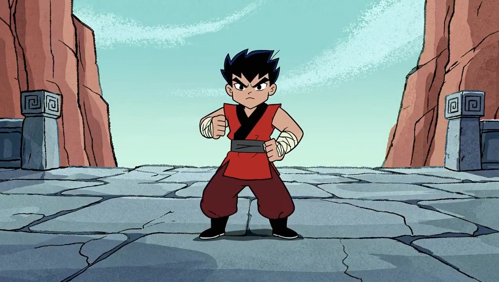

[](README.md) [](README_ja.md) [](README_ko.md) [](README_es.md)

<div align="center">
  

  # 🐴 HappyHorse 提示词集合

  **社区驱动的 [HappyHorse](https://happyhorses.io) AI 视频生成提示词开源库**

  [](https://awesome.re)
  [](https://github.com/Ericgood/happyhorse-prompt)
  [](https://creativecommons.org/licenses/by/4.0/)
  [](https://github.com/Ericgood/happyhorse-prompt/pulls)

</div>

---

## 🐴 HappyHorse 是什么？

**HappyHorse-1.0** 是一个 150 亿参数的统一 Transformer 模型，能够从文本同时生成视频和音频 — 无需后期配音。它于 2026 年 4 月初以匿名身份登上 [Artificial Analysis](https://artificialanalysis.ai/) 视频竞技场排行榜，迅速夺得 **第一名**，超越了 Seedance 2.0、Kling 3.0、PixVerse V6 等成熟模型。

### 核心亮点

- 🏆 **AI 视频竞技场 #1** — Elo 1333（文本生成视频），Elo 1392（图片生成视频）
- 🧠 **150 亿参数** — 40 层单流 Transformer，无交叉注意力机制
- 🎬 **视频 + 音频联合生成** — 对话、环境音、拟音效果与视频帧同步生成
- 🗣️ **多语言唇形同步** — 支持中文、英语、日语、韩语、德语、法语、粤语
- ⚡ **8 步去噪** — 通过 DMD-2 蒸馏实现快速推理，无需 CFG
- 📖 **开源** — 基础模型、蒸馏模型、超分辨率模块和推理代码（含商用许可）

### 架构设计

模型采用**单流自注意力 Transformer** 架构，文本 token、参考图像潜变量、带噪视频和音频 token 在同一序列中联合去噪。前 4 层和后 4 层使用模态专用投影；中间 32 层在所有模态间共享参数。

> *"开源社区此前从未有人从零开始做过真正的音视频联合预训练。"*
>
> — [36Kr 关于 HappyHorse 的报道](https://eu.36kr.com/en/p/3757826958635781)

### 排行榜排名

| 类别 | Elo 分数 | 排名 |
|:---|:---:|:---:|
| 文本生成视频（无音频） | **1333** | 🥇 第一 |
| 图片生成视频（无音频） | **1392** | 🥇 第一 |
| 文本生成视频（含音频） | 1205 | 🥈 第二 |
| 图片生成视频（含音频） | 1161 | 🥈 第二 |

*数据来源：[Artificial Analysis Video Arena](https://artificialanalysis.ai/)，2026 年 4 月。*

### 竞品对比

| 模型 | T2V Elo | 备注 |
|:---|:---:|:---|
| **HappyHorse-1.0** | **1333** | 开源，音视频联合生成 |
| Seedance 2.0 (720p) | 1273 | 字节跳动，音频同步领先 |
| SkyReels V4 | 1244 | $7.20/分钟 |
| Kling 3.0 1080p Pro | 1241 | $13.44/分钟 |
| PixVerse V6 | 1239 | $5.40/分钟 |

### 神秘身世

至今无人公开确认 HappyHorse-1.0 的创建者。Artificial Analysis 将其描述为**"匿名"模型**。社区调查表明，它可能是基于开源模型 [daVinci-MagiHuman](https://github.com/BrightXiaoHan/MagiHuman) 的迭代优化版本，可能与 Sand.ai 和上海 GAIR 实验室有关。命名恰逢 2026 年为中国农历**马年**。

> *来源：[36Kr](https://eu.36kr.com/en/p/3757826958635781) · [WaveSpeed AI](https://wavespeed.ai/blog/posts/what-is-happyhorse-1-0-ai-video-model/) · [Apiyi 分析](https://help.apiyi.com/en/happyhorse-model-mystery-ai-video-lmarena-analysis-en.html)*

---

## 📊 数据统计

| 提示词总数 | 精选 | 最后更新 |
|:---:|:---:|:---:|
| 18 | 7 | 2026 年 4 月 |

---

## 🏆 官方演示 — HappyHorse 生成

这些提示词是 HappyHorse 的官方能力展示，涵盖物理感知运动、流体动力学、角色动画、时间一致性和同步音频生成。

---

### 1. 🎯 呼啦圈小孩


> 物理感知运动 — 呼啦圈从腰部爬升、下降、掉落，具有真实的重量感和动量。

#### 📝 提示词

```
A hula hoop spinning on a kid's waist, gradually climbing to their chest, then dropping
to knees, then clattering to the floor. They pick it up to try again.
```

<div align="center">
  <a href="videos/hula-hoop-kid.mp4">
    
  </a>
  <br>
  <a href="videos/hula-hoop-kid.mp4">📥 下载视频</a> ・ <a href="https://x.com/i/status/2041591993386856448">🐦 源推文</a>
</div>

---

### 2. ⛳ 高尔夫推杆


> 角色情绪与物理同步 — 高尔夫球手的肢体语言随球在杯沿每次旋转而变化。

#### 📝 提示词

```
A golf ball in a cup rolling around the rim three times before finally dropping in.
The golfer's body language matches each rotation. Audio: Ball rattle, exhale, plop.
```

<div align="center">
  <a href="videos/golf-ball-putt.mp4">
    
  </a>
  <br>
  <a href="videos/golf-ball-putt.mp4">📥 下载视频</a> ・ <a href="https://x.com/i/status/2041591995106521352">🐦 源推文</a>
</div>

---

### 3. 🐱 猫咪与烤面包机倒影


> 反射渲染 + 动物动画 — 猫咪轻拍铬面烤面包机，扭曲的倒影回拍。

#### 📝 提示词

```
A cat staring at its own reflection in a toaster, paw tapping the chrome surface.
The distorted cat reflection taps back. Audio: Paw taps, confused meow.
```

<div align="center">
  <a href="videos/cat-toaster-reflection.mp4">
    
  </a>
  <br>
  <a href="videos/cat-toaster-reflection.mp4">📥 下载视频</a> ・ <a href="https://x.com/i/status/2041591996754903188">🐦 源推文</a>
</div>

---

### 4. ☕ 咖啡师拉花


> 流体动力学杰作 — 牛奶没入咖啡脂下方，随后突破表面，精确的手腕摆动形成玫瑰花图案。

#### 📝 提示词

```
A barista creating latte art by pouring steamed milk into espresso. The white milk
submerges beneath the brown crema initially, then breaks through the surface as the
cup fills. The barista's wrist makes precise oscillating movements, creating a rosetta
pattern. The milk and espresso maintain their distinct colors while interacting at
the boundary. Audio: The gentle pour of liquid, the hiss of the steam wand in the
background.
```

<div align="center">
  <a href="videos/barista-latte-art.mp4">
    
  </a>
  <br>
  <a href="videos/barista-latte-art.mp4">📥 下载视频</a> ・ <a href="https://x.com/i/status/2041591999061758171">🐦 源推文</a>
</div>

---

### 5. 🌸 花开花落延时摄影


> 模拟两周时间跨度的时间一致性 — 同一花瓶、同一窗户、同一角度，光线随天气自然变化。

#### 📝 提示词

```
A flower blooming and wilting over two weeks, one photo per day. Same vase, same window,
same angle. Light changes with weather. Audio: Quiet domestic.
```

<div align="center">
  <a href="videos/flower-bloom-timelapse.mp4">
    
  </a>
  <br>
  <a href="videos/flower-bloom-timelapse.mp4">📥 下载视频</a> ・ <a href="https://x.com/i/status/2039462980715524457">🐦 源推文</a>
</div>

---

### 6. 🔥 90年代动作卡通火焰术


> 复古卡通风格 — 手绘火焰配粗线条，动漫风格的战斗姿态，年代感十足的分层烟雾效果。

#### 📝 提示词

```
1990s action cartoon style  A young martial artist performs a firebending kata. The flames
are hand-drawn with thick outlines and bold orange-yellow gradients. Dynamic camera swoops
around the character. The fighting stance shows anime influence while maintaining Western
animation proportions. Smoke effects use the signature layered look of the era. Audio:
Whooshing fire, martial arts grunts, dramatic percussion.
```

<div align="center">
  <a href="videos/firebending-kata.mp4">
    
  </a>
  <br>
  <a href="videos/firebending-kata.mp4">📥 下载视频</a> ・ <a href="https://x.com/i/status/2039465595041890540">🐦 源推文</a>
</div>

---

### 7. 🤖 赛博朋克动漫机器人维修


> 赛博朋克动漫美学 — 精密机械内部构造、霓虹雨夜氛围、蓝粉色冷色调与环境音效。

#### 📝 提示词

```
Cyberpunk anime style  (aesthetic). A female android sits in a maintenance chair as robotic
arms repair her damaged arm. The skin panel is open, revealing intricate servos and
fiber-optic cables beneath. Her eyes are blank and unfocused during the repair cycle. Neon
city lights filter through rain-streaked windows. Cool blue and pink color palette with high
contrast shadows. Audio: Mechanical whirring, the hum of electronics, distant city ambience.
```

<div align="center">
  <a href="videos/cyberpunk-android-repair.mp4">
    
  </a>
  <br>
  <a href="videos/cyberpunk-android-repair.mp4">📥 下载视频</a> ・ <a href="https://x.com/i/status/2039465595041890540">🐦 源推文</a>
</div>

---

## 🤝 如何贡献

我们欢迎所有人贡献提示词！

### 通过 Pull Request 提交

1. **Fork** 这个仓库
2. **添加你的提示词** — 在对应的 `prompts/<分类>/` 目录下创建 Markdown 文件，参考下方模板
3. **提交 PR** — 我们会审核并合并！

### 提示词模板

创建一个文件，如 `prompts/cinematic/my-awesome-prompt.md`：

```markdown
---
title: 你的提示词标题
author: 你的名字
author_link: https://twitter.com/yourhandle  # 可选
model: HappyHorse
category: cinematic
video_url: https://...  # 可选，生成视频的链接
date: 2026-04-09
---

## 描述

简要描述这个提示词能生成什么效果。

## 提示词

你的完整提示词文本...

## 预览


```

### 通过 Issue 提交

不想提 PR？直接[提交 Issue](https://github.com/Ericgood/happyhorse-prompt/issues/new)，附上你的提示词，我们会帮你添加！

### 投稿规范

- ✅ 你原创或有权分享的提示词
- ✅ 注明使用的模型（如 HappyHorse）
- ✅ 添加预期效果描述
- ✅ 强烈建议附上视频/图片预览
- ❌ 禁止 NSFW 内容
- ❌ 禁止复制受版权保护的角色

## 📜 许可证

本项目采用 [CC BY 4.0](https://creativecommons.org/licenses/by/4.0/) 许可证。你可以自由分享和改编这些提示词，但需注明出处。

## 🌐 链接

- 🐴 [HappyHorse 官方网站](https://happyhorses.io)
- 📰 [36Kr：HappyHorse 深度解析](https://eu.36kr.com/en/p/3757826958635781)
- 📊 [Artificial Analysis 视频竞技场](https://artificialanalysis.ai/)
- 💬 [讨论区](https://github.com/Ericgood/happyhorse-prompt/discussions)
- 🐛 [反馈问题](https://github.com/Ericgood/happyhorse-prompt/issues)

---

<div align="center">

**觉得有用？给我们一个 ⭐ 吧！**

由 HappyHorse 社区用 ❤️ 打造

</div>
